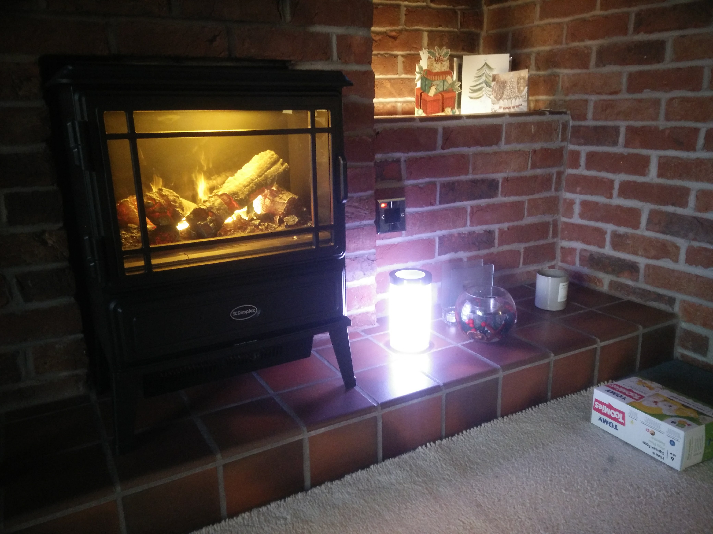
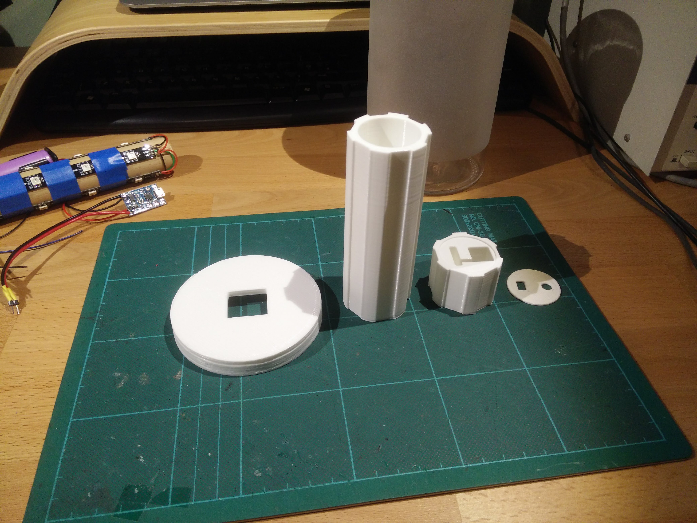

# LED Glow Jar

A battery powered full colour LED jar

### The Finished Product

And this is what we will end up with! I made this particular one as a present for my mum for Christmas 2017.

It's hard to tell from the picture here, but the LEDs are all white and are all fading up and down, each with their own random start position, so it's never completely dark (or on full brightness), rather it has has a nice twinkling effect. The LEDs are also only driven to a maximum of half brightness.

The single 18650 Li-ion battery gave around 7 hours of use. I forgot to time how long it took to charge it via USB once fully discharged.

### Component Parts

This project came together in a short space of time before the hard deadline of being given as a present for Christmas, and was only really kickstarted when I spotted a nice Jar to use in IKEA.

This would be combined with an 18650 battery to provide power (and not require it to be plugged in continuously), an ESP8266 ESP-01 board (which is nice and small, WiFi a bonus), WS2801 LEDs (aka 'NeoPixels'), and a 3D printed insert for the jar.

### Prototype

I started with the rough idea I'd had a column of LEDs in the middle of a jar, so I came back from [IKEA with one of these jars](http://www.ikea.com/gb/en/products/cookware/food-storage-organising/droppar-jar-with-lid-frosted-glass-stainless-steel-art-80112541/):

And here is ready to be used for a non-standard purpose:

The lid isn't a screw top, rather it has a rubber seal, so it just pops off like so:

Taping a few LEDs to a bit of wooden dowel from the garage got me something a bit like this:

Here I have 4 strips of
WS2801 LEDs (the 30 LEDs/m type), and have wired them up so that I've got 0v/5v/Data wires hanging out the top.

Together with this I aim to attach an 18650 Li-ion battery (in a holder):

And also a battery charger and protection board:

I bought the charger board and the battery box as a pair [from eBay](https://www.ebay.co.uk/itm/112646759027), well, actually I bought 3, and they seem to be plentiful - both from UK sellers and cheaper from China.

This charging board provides battery cutoff when the battery gets sufficiently dischanged, but also a 1A charging circuit that is powered though a micro USB socket - incredibly handy as everyone (even my mum) has one of those lying around.

The battery I have here is an old rescued cell from a Lenovo laptop battery, so nothing fancy, but importantly it is not protected, so some kind of cut-off circuit such as this is essential to avoid damaging the battery.

So here is those parts soldered together, ready to receive some control circuitry:

Next up was the ESP8266 based control circuit. It would receive a regulated 3.3v from the battery, and provide a data signal to the LEDs - which would be directly powered from the battery. There might appear to be a lot of wires here, but really it is just the bits needed to program the ESP-01 board (which needs two external switches attached, along with an USB>Serial converter), and the 3.3v regulator at the far end.

It was at this point I found that my bit of wood was going to be too small to hold a battery and any amount of circuit boards, so in tandem with writing some driver code I started to learn how to use the 3D printer at work.

I have been learning Fusion360 a bit recently, so I decided to use that, and came up with this 4 part design:

We have, from left to right:

1. A top cap, with holes for a switch, and USB connector
1. A top-section which holds the charging PCB firmly (so that it doesn't move when you attach/remove the USB cable).
1. A main section that holds the battery (in its battery box), and (hopefully!) has enough space to wedge the ESP-01 board at the bottom - so that it can 'easily' be reprogrammed after installation
1. And finally a base that will fit the whole thing nicely at the bottom the jar.

The sizes were what I thought looked about right with respect to the jar.
- The base just fits through the top of the jar, but rattles around a little bit at the bottom, but that is fine.
- Off the top there is a switch lever, so I left enough space for that so that it didn't hit the jar lid.
- I went with channels for the LEDs to hold them neatly, and went with 6 as that would give me options of using 3 or 6 strips depending on what looked best whilst weighing up the power requirements of more LEDs.

A quick 3D print of the top sections, and installing some LEDs gave me something I could use instead of the bit of wood:

Here is the top section, which has the switch and PCB inserted in:

The exactly dimensioned holds for the switch and PCB stopped them moving, but it did take two attempts to print this part so that they fit in properly - the curved corners of the recess as a result of the 3D printer's movement meant the PCB didn't fit in the first time, so I made things a little bigger for version 2.

And here we have the battery in the hollowed out main section. Perhaps a little more snug than I would have liked, but it's in :) Also shown, the top cap that the switch and USB socket poke through

I haven't mentioned it thus far, but by now I had some [code written in the Arduino IDE](https://github.com/fraz3alpha/led-glow-jar/blob/master/esp8266/arduino-ide/led-glow-jar.ino) for the ESP board to flash the LEDs in various patterns to check everything worked. The code uses the [Adafruit_NeoPixel library](https://github.com/adafruit/Adafruit_NeoPixel), which just works, so why re-write it. The StrandTest example sketch is excellent at initially testing your wiring, and in particular the rainbow effect is my go-to display.

You can install the library via the Arduino IDE's library manager.

So, with all the bits looking good, what else do we need to do for a proper version?

### Pre-Production Adjustments

The 3D printed parts worked well, but being RED they were very visible through the frosted jar, so it was important to try and print these in white if possible. The 3D printer I have access to had red filament in at the time, which is why everything was red up to this point, but I found some white PLA, so we'll switch to that for the proper version.

Some small adjustments to the 3D parts were needed however, some of which I have alluded to already, and are all down to the tolerance to which the printer prints what I've asked of it.

1. The grooves for the LED strips are too tight, and the strips don't fit in them.
1. The battery box is a bit of a squeeze
1. The base doesn't fit through the jar opening without giving it a whack, so needs to be a bit smaller / smoother on the outside.

All-in-all, no big deal really, and is to be expected for my first 3D printing experiment.

### Production Construction!

First up, print everything in white!

Then a quick check everything looks like it will go together

Glue everything with whatever superglue is lying around, in this case some Loctite cyanoacrylate based glue which should do the job (I hope, I've never glued PLA before, but it seems to glue everything else!)

Doing it sort-of-properly, I put a connector on the battery box in case it needed to be removed later

Likewise the charging board got a similar connector. The wires here were sized so that I could pull the battery out of the bottom of the central column if needed, the downside being all that wire had to fit in the small space above the battery, but below the switch - but it fit!

The donor 3.3v regulator, which I had to hand. It was on a small PCB, which was fine, but obviously took up more space than I would have liked

The charger board is slotted in

And the switch went in to. This goes between the charger/protection board and the LEDs/regulator. The battery remains connected directly to the protection board so that it can be charged when turned off.

The cap isn't glued, but in the final stages I drill a small pilot hole and put a tiny screw in it to hold it down

With the wires hanging out the bottom I can start pushing other bits up

It is a tight squeeze, but the battery box goes in, leaving some space at the very bottom

Test fitting the ESP and regulator boards - just enough space!

Before the electronics go in the bottom I need to pass through the wiring for the LEDs. I forgot to model a hole for this, so I just drilled one

With all the LED wires coming out the bottom I can make some connectors for the ESP-01 board

With the regulator soldered in, that's everything connected

... and wedge them in! ...

A quick test of a single strand of LEDs

And a quick test to see how it looks behind the frosted glass. N.B. it is very hard to photograph!

And whilst in a testing mood, I plug the charger in. It glows red when charging, and blue when charged. I drilled a small hole to let the light out from the charging board :)

All the LEDs strips are attached now, and because I didn't yet have any white insulation tape, it will have to be blue for now

At this point I realised that my code only referenced 1/2 of the LEDs, so I had to reprogram it, here you can see how I can get the ESP-01 board out, unplug everything, and then attach it to my programmer, before putting it back.

All the LEDs on for a test!

I have actually skipped a step here, but I have used lots of short bits of wire to wire up all the strips with power and data - the white wires are hidden beneath all the blue tape!

And putting it in the jar, it looks rather nice if I do say so!

### Completion

And here it is on my mum's fireplace :)

P.S. It went down very well as a present :)
